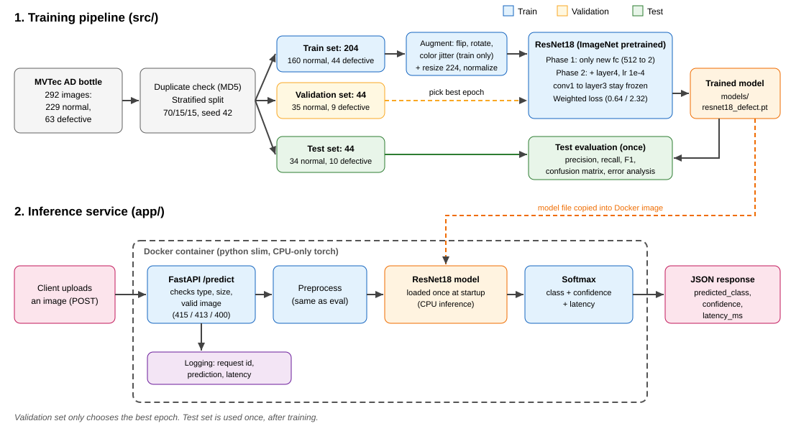

# Visual Defect Detection (Normal vs Defective)

Image classifier for products on a production line, served through a FastAPI API and packaged with Docker.
Model: ResNet18 (ImageNet pretrained, transfer learning), CPU only.



## Dataset strategy

The dataset mentioned in the assignment was not provided, so the public **MVTec AD "bottle"** category was used.

- Normal = train/good + test/good (229 images). Defective = broken_large, broken_small, contamination (63 images). Imbalance 3.63 : 1.
- All images are 900x900 RGB. Pixel masks are not used (image-level classification only).
- MVTec has no ready train/val/test split for this task, so all images were pooled, checked for duplicates (0 found, MD5 hash) and split with a **stratified 70/15/15 split, seed 42**: train 204 (160 normal / 44 defective), val 44 (35 / 9), test 44 (34 / 10). The split is saved in `outputs/split_summary.csv`.
- The split is done before augmentation, so no test information leaks into training.
- The dataset is not included in this repo. Download the bottle category from https://www.mvtec.com/research-teaching/datasets/mvtec-ad/downloads and extract it into `data/raw/` (so that `data/raw/bottle/train/good` exists).
- **Credit and license:** MVTec AD by MVTec Software GmbH (Bergmann et al., CVPR 2019), license CC BY-NC-SA 4.0, non-commercial use only.
- If a real customer dataset arrives, the same code can be reused; only the folder paths and class folder names in the scripts change.

## Model approach

- **ResNet18 pretrained on ImageNet**, last layer replaced with 2 outputs (normal, defective). Reasons: only 204 training images, so training from scratch would overfit; it is small and fast on CPU, which gives low API latency; it is a well known, reliable baseline.
- Transfer learning in 2 phases: first only the new last layer is trained (5 epochs, lr 1e-3), then the last block `layer4` is also fine-tuned (5 epochs, lr 1e-4).
- **Imbalance handling:** weighted cross-entropy loss (weights: normal 0.64, defective 2.32), because a missed defect is more costly than a false alarm.
- **Augmentation (train only):** resize 224, horizontal/vertical flip, rotation up to 15 degrees, small brightness/contrast jitter. Validation and test only use resize + ImageNet normalization.
- The best epoch is chosen on the validation set (highest defective F1, ties broken by lower validation loss). The test set was used only once at the end.

## Evaluation results (test set, 44 images)

| Class     | Precision | Recall | F1    | Support |
| --------- | --------- | ------ | ----- | ------- |
| normal    | 1.000     | 1.000  | 1.000 | 34      |
| defective | 1.000     | 1.000  | 1.000 | 10      |

Confusion matrix: TN 34, FP 0, FN 0, TP 10 (see `outputs/confusion_matrix.png`).

FP (false alarm) means an extra manual check. FN (missed defect) means a bad product reaches the customer, which is worse, so recall on the defective class is the most important metric.

### Error analysis

There were no false positives or false negatives on the test set, so the 5 correct predictions with the lowest confidence were checked (`outputs/error_analysis/`). The least confident ones were all **normal** bottles (confidence 0.83 to 0.89), while all defect types were predicted with 0.98 to 1.00 confidence. The model is slightly unsure about normal bottles, not about defects.

## API

Run locally:

```
python -m uvicorn app.main:app --port 8000
```

- `GET /health` returns `{"status": "ok"}`.
- `POST /predict` takes an image file (JPEG or PNG, max 5 MB) and returns `predicted_class`, `confidence` and `latency_ms`.
- Errors: 415 wrong file type, 413 file too large, 400 corrupted image, 500 inference error. Every request is logged with a request id, prediction and latency. The model is loaded once at startup.

Interactive docs: http://localhost:8000/docs

### Example predictions (run inside Docker, CPU)

Defective image (`broken_large/000.png`):

```
{"predicted_class": "defective", "confidence": 1, "latency_ms": 415.4}
```

Normal image (`good/000.png`):

```
{"predicted_class": "normal", "confidence": 0.7852, "latency_ms": 64.9}
```

Screenshots: `docs/predict_defective.png`, `docs/predict_normal.png`.
Latency is about 65 ms per image on CPU. The first request is slower (about 400 ms) because of model warm-up.

## Setup and reproduce

```
python -m venv venv
.\venv\Scripts\Activate.ps1
pip install -r requirements.txt
python src\analyze_dataset.py   # counts, imbalance, sample grid
python src\split_dataset.py     # duplicate check + 70/15/15 split
python src\train.py             # trains ResNet18, saves models/resnet18_defect.pt
python src\evaluate.py          # test metrics + confusion matrix
python src\error_analysis.py    # near-miss and error images
python -m pytest                # API tests
```

The trained model `models/resnet18_defect.pt` is included, so training is optional.

## Docker

```
docker build -t defect-detection .
docker run -p 8000:8000 defect-detection
```

The image uses python slim and CPU-only torch, and contains only the app and the model. A healthcheck calls `/health`.

## Project structure

```
src/      training, evaluation, error analysis scripts
app/      FastAPI inference service
tests/    API tests (pytest)
models/   trained model
outputs/  split file, confusion matrix, error analysis images
docs/     architecture diagram, example prediction screenshots
```

## Known limitations

- The test set is small (44 images, only 10 defective), so a perfect score is not strong proof. More data is needed before production.
- MVTec bottle is an easy dataset (clean background, same camera and lighting). Performance may drop with different lighting, cameras or new defect types.
- Only 3 defect types were seen in training. An unseen defect type may be missed.
- The model is slightly unsure on normal bottles (confidence 0.78 to 0.89). The decision threshold should be calibrated on validation data and the model monitored in production.
- Model selection uses a validation set with only 9 defective images, so it is noisy.
- Not covered: GPU inference, batch inference, authentication, model versioning and monitoring.
